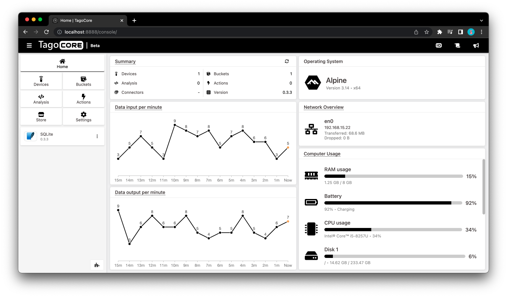

 

  </img>

# TagoCore

> TagoCore is a free, fast, and open-source IoT platform for edge computing

## The Repository

This repository is where we (TagoIO Inc.) develop the [TagoCore](https://tagocore.com) product together with the community. Here, we work on code, address issues, and develop features collaboratively. The source code is available to everyone under the [Apache License 2.0](https://github.com/tago-io/tcore/blob/main/LICENSE).

## TagoCore

  

[TagoCore](https://tagocore.com) is a free, fast, and open-source IoT platform for edge computing, allowing you to parse, analyze, and manage data from your devices.

TagoCore is distributed as a Docker image, which you can access on [Docker Hub](https://hub.docker.com/r/tagoio/tagocore).

## Related Projects

* [TagoCore Website](https://github.com/tago-io/tagocore-website) - Official website for TagoCore.
* [TagoCore Documentation](https://github.com/tago-io/tagocore-docs) - Comprehensive documentation for TagoCore, including setup guides and API references.

## Contributing

There are many ways to participate in this project, including:

* [Submit bugs and feature requests](https://github.com/tago-io/tcore/issues) and help us verify as they are checked in
* Review [source code changes](https://github.com/tago-io/tcore/pulls)

## Feedback

* Ask a question on [Our Community](https://help.tago.io/portal/en/community/tagoio/tagocore)
* Upvote [popular feature requests](https://github.com/tago-io/tcore/issues?q=is%3Aopen+is%3Aissue+label%3Afeature-request+sort%3Areactions-%2B1-desc)
* [File an issue](https://github.com/tago-io/tcore/issues)

## License

This repository is licensed under the [Apache License 2.0](LICENSE).

### Copyright Notice

TagoIO Inc. retains all rights to the TagoCore name, logo, and branding assets. These materials are not covered under the Apache License and may not be used without explicit permission from TagoIO Inc.

### Third-Party Plugins and Open Source Images

This repository may contain third-party plugins and open-source images that are subject to their own licenses. Please refer to individual files and documentation for specific licensing terms.

---

*This software is provided by TagoIO Inc. under the Apache License 2.0. For questions or additional permissions, please contact us.*
