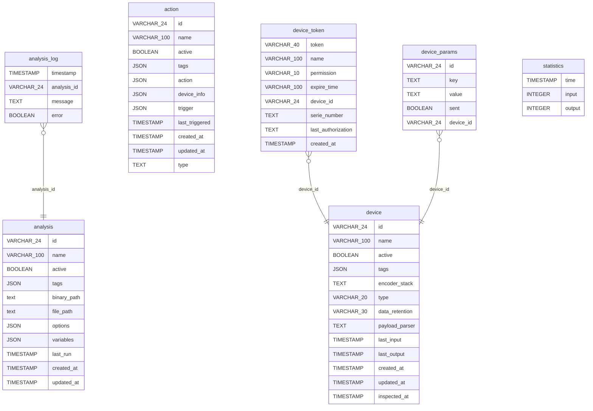

# Database model

The



### device database

```mermaid
erDiagram
   data {
    VARCHAR_24 id
    VARCHAR_100 variable
    VARCHAR_15 typ`
    TEXT value
    VARCHAR_100 unit
    VARCHAR_24 group
    JSON location
    JSON metadata
    TIMESTAMP time
    TIMESTAMP created_at
  }

```
